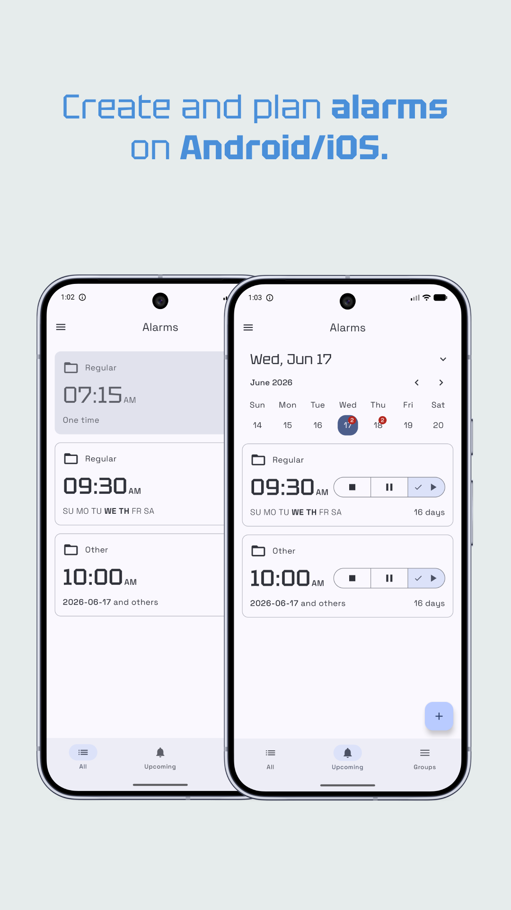
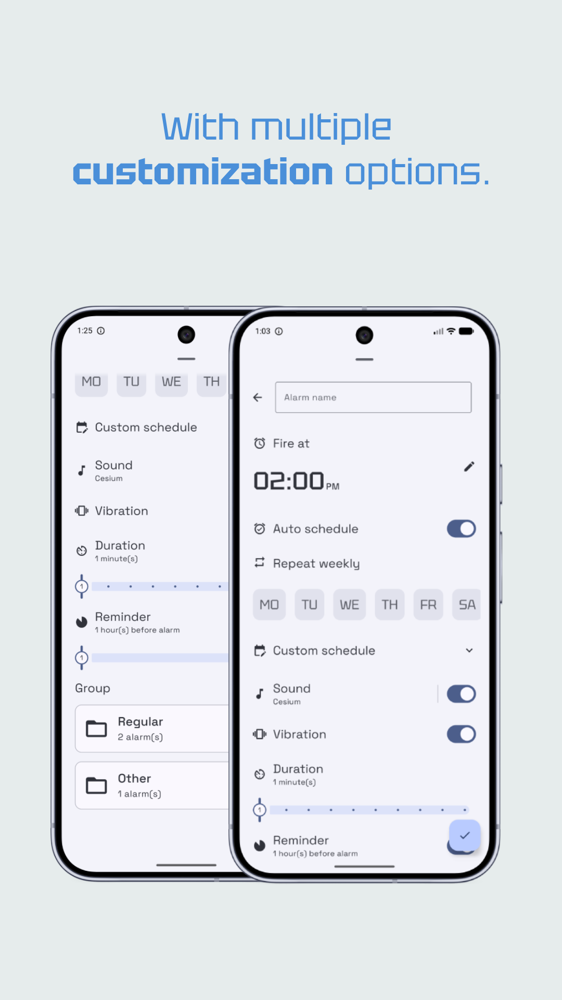
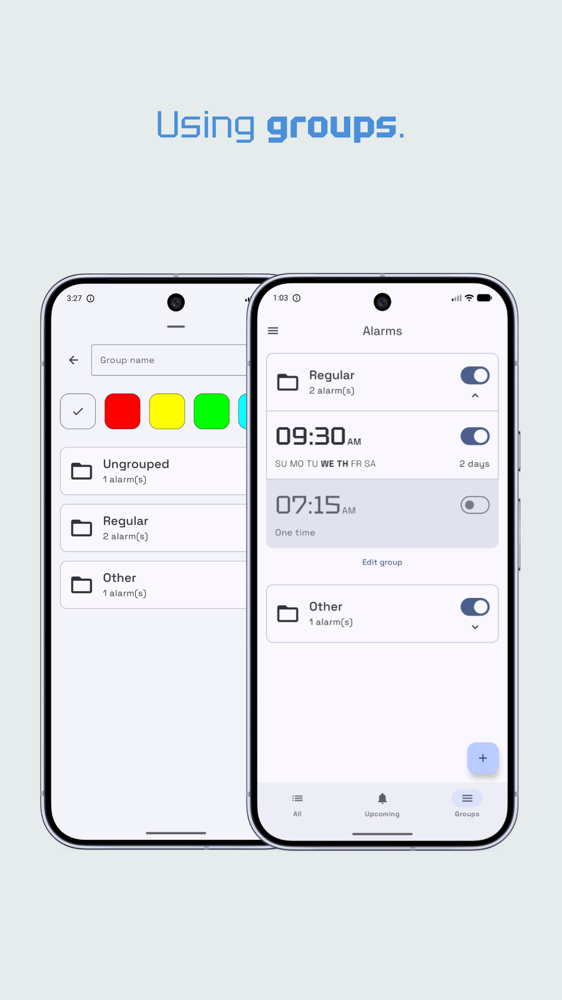
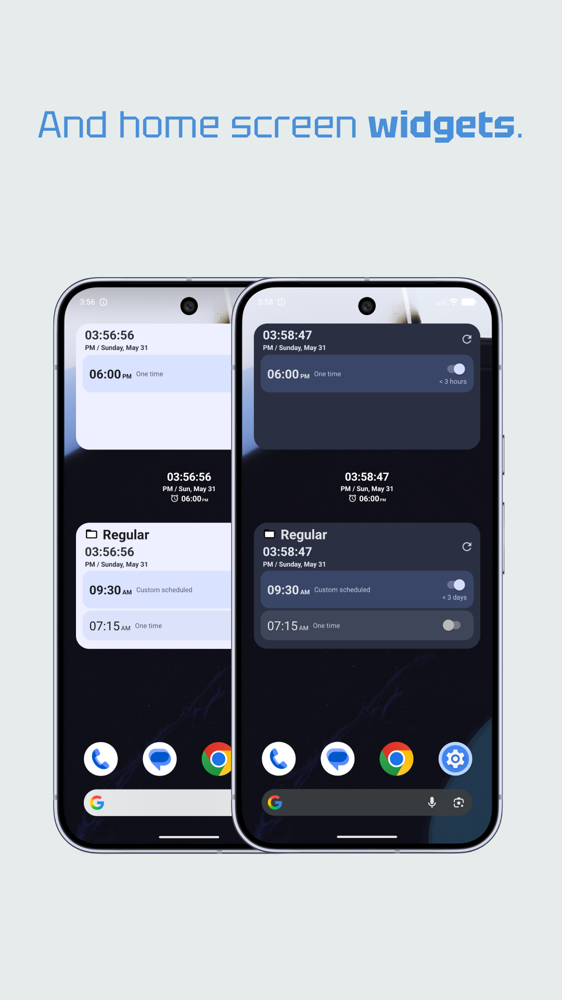
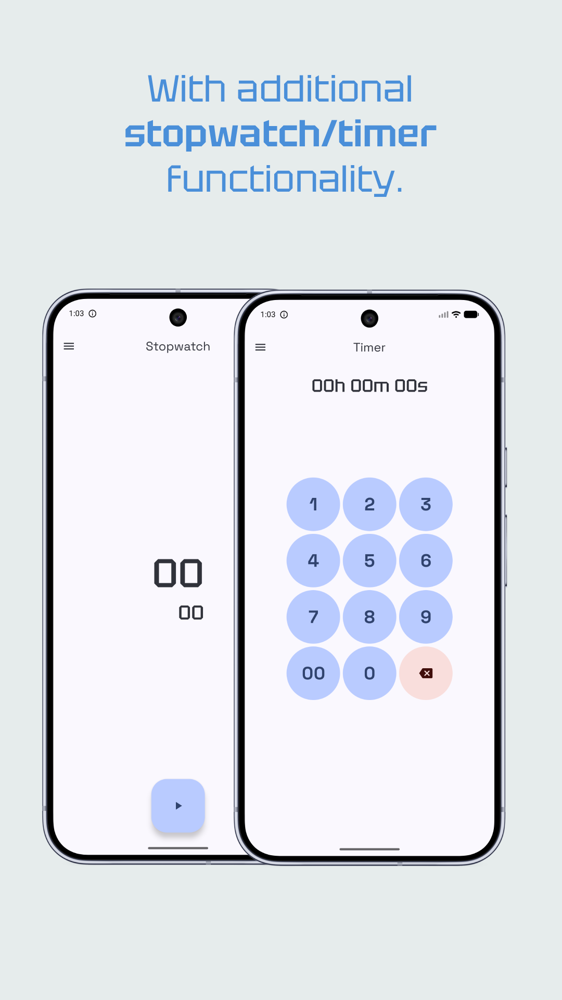
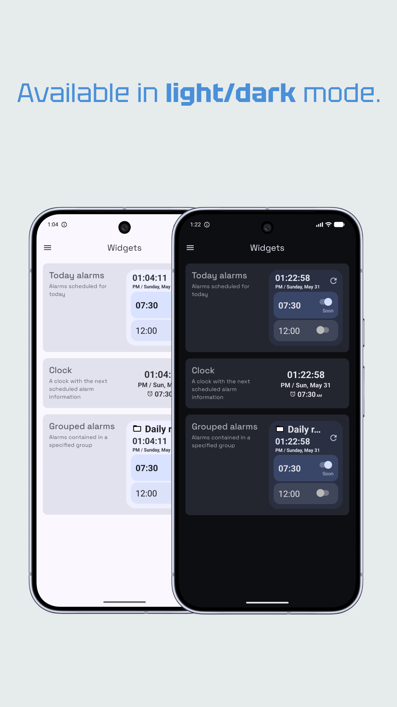

  

## About
**_Alarmist_** is a Material 3 themed Compose Multiplatform app for creating and managing **alarms** using **groups** and home screen **widgets**.

    
Table of Contents

    <ol>
        <li><a href="#screenshots">Screenshots</a></li>
        <li><a href="#features">Features</a></li>
        <li><a href="#used-technologies">Used technologies</a></li>
    </ol>

## Screenshots

## Features
- **Calendar** for alarm planning/management
- **Groups** for alarm organization
- Home screen **widgets**
- Stopwatch
- Timer

## Used technologies
- [Compose Multiplatform](https://github.com/JetBrains/compose-multiplatform) - shared declarative UI framework
- [Decompose](https://github.com/arkivanov/Decompose) - screen flows definition and backstack management
- [SQLDelight](https://cashapp.github.io/sqldelight/) - database for local data persistence
- [Koin](https://insert-koin.io/) - dependency injection
- [Coroutines](https://kotlinlang.org/docs/coroutines-guide.html) - asynchronous/concurrent programming
- [Glance](https://developer.android.com/develop/ui/compose/glance) - compose-based home screen widgets
- [WorkManager](https://developer.android.com/jetpack/androidx/releases/work) - periodic widget updates
- [kotlinx-datetime](https://github.com/Kotlin/kotlinx-datetime) - date and time handling
- [Kotlinx Serialization](https://github.com/Kotlin/kotlinx-serialization) - JSON serialization/deserialization
- [Napier](https://github.com/aakira/Napier) - multiplatform logging library
